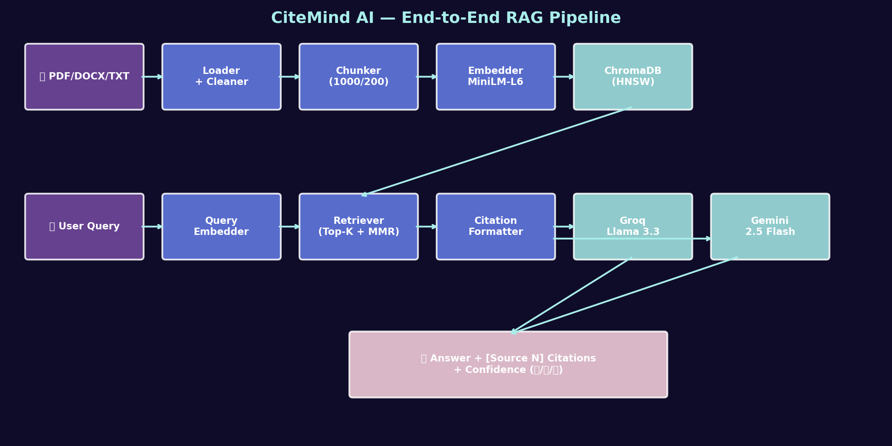
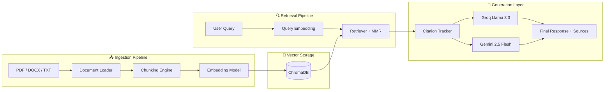
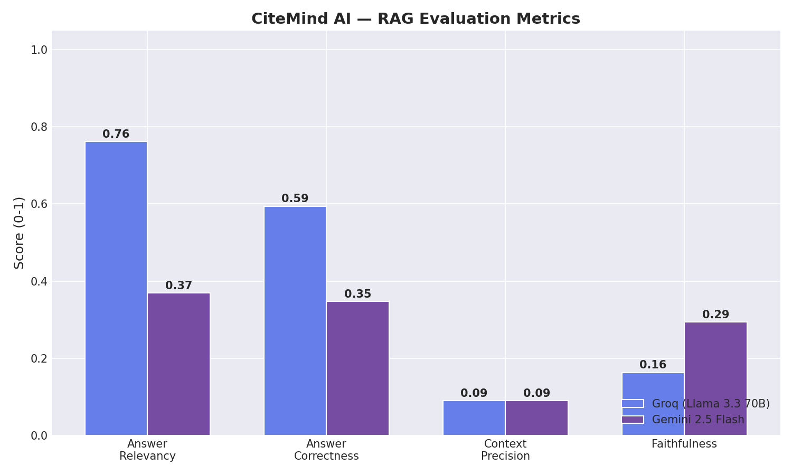

<div align="center">

<h1>🧠 CiteMind AI</h1>

<h3><i>Trustworthy AI Research Assistant with Verifiable Citations</i></h3>

<p><b>Stop trusting hallucinating AI. Start verifying every answer.</b></p>

<p align="center">
  
  
  
  
  
  
</p>

<p align="center">
  
  
  
  
</p>

---

<h3>🚀 AI-Powered Research. Grounded in Real Sources.</h3>

<p>
CiteMind AI combines advanced Retrieval-Augmented Generation (RAG), dual-LLM reasoning,
semantic search, and citation tracking to create a research assistant that actually verifies its answers.
</p>

<p>
🔗 <a href="#-live-demo">Live Demo</a> •
📖 <a href="#-documentation">Documentation</a> •
⚡ <a href="#-quick-start">Quick Start</a> •
📊 <a href="#-evaluation-results">Evaluation</a>
</p>

</div>

---

# 🎬 Live Demo
<div align="center">

<h1>🎬 Live Demo</h1>

<p>
📺 <b>Demo Video:</b> Add your Loom / YouTube link here
</p>


<h3>✨ Upload papers → Ask questions → Get cited answers instantly</h3>

</div>

---

# 🌟 Why CiteMind AI?

| 🛡️ Anti-Hallucination | ⚡ Dual LLM Architecture | 📚 Verifiable Citations |
|---|---|---|
| Refuses to answer when retrieval confidence is low. No fake citations. | Switch between Groq (speed) and Gemini (deep reasoning). | Every claim links back to document + page + chunk. |

---

# 🎯 The Problem

Every year, researchers face an overwhelming flood of academic information.

- 📄 **Millions of new papers** published annually  
- ⏳ Researchers spend countless hours on literature review  
- 🤖 Traditional LLMs hallucinate facts and invent citations  
- 🔍 Search engines return documents, not trustworthy answers  

## The Result

AI becomes fast — but unreliable for serious research.

---

# 💡 The Solution

CiteMind AI solves this using an advanced **Retrieval-Augmented Generation (RAG)** pipeline.

```text
📄 Documents
      ↓
🧠 Semantic Retrieval
      ↓
📌 Citation Tracking
      ↓
🤖 Grounded LLM Generation
      ↓
✅ Verifiable Research Answers
```
### Core Innovations

* 🔍 Semantic document search
* 📚 Chunk-level citation grounding
* ⚡ Dual-LLM reasoning system
* 🚦 Confidence-aware refusal mechanism
* 🛡️ Hallucination-resistant responses

---

# 🏗️ System Architecture

<div align="center">



</div>



---

# ✨ Features

## 📄 Multi-Format Document Support

* PDF ingestion with page metadata
* DOCX document parsing
* TXT file support
* Drag & drop uploads
* Persistent vector storage

---

## 🔍 Advanced Retrieval System

* Dense semantic search
* MMR re-ranking
* Top-K retrieval optimization
* Fast embedding-based similarity search
* Context-aware chunk selection

---

## 🤖 Dual LLM Architecture

| Model                | Purpose                     |
| -------------------- | --------------------------- |
| ⚡ Groq Llama 3.3 70B | Ultra-fast responses        |
| 🧠 Gemini 2.5 Flash  | Deeper reasoning & analysis |

### Benefits

* Live model switching
* Speed vs reasoning flexibility
* Better experimentation for research workflows

---

## 🛡️ Hallucination Protection

CiteMind AI uses a **3-tier confidence system**:

| Confidence | Behavior               |
| ---------- | ---------------------- |
| 🟢 High    | Confident cited answer |
| 🟡 Medium  | Answer with warning    |
| 🔴 Low     | Refuses to hallucinate |

### No fake citations. No fabricated facts.

---

# 🖼️ Screenshots

## 💬 Chat Interface


---

## 📤 Upload & Indexing


---

## 📚 Citation Verification Panel


---

## 🔄 Dual LLM Comparison


---

# 🛠️ Tech Stack

| Layer              | Technology              |
| ------------------ | ----------------------- |
| 🐍 Language        | Python 3.12             |
| 🔗 Framework       | LangChain               |
| 🧮 Embeddings      | all-MiniLM-L6-v2        |
| 💾 Vector Database | ChromaDB                |
| ⚡ Fast LLM         | Groq                    |
| 🧠 Reasoning LLM   | Gemini 2.5 Flash        |
| 🎨 Frontend        | Streamlit               |
| 📊 Visualization   | Matplotlib              |
| 📄 Parsing         | pdfplumber, python-docx |

---

# ⚡ Quick Start

## 📦 Installation

```bash
# Clone repository
git clone https://github.com/ns-niam/CiteMind.ai.git

# Enter project
cd CiteMind.ai

# Install dependencies
pip install -r requirements.txt
```

---

## 🔑 Environment Variables

Create a `.env` file:

```env
GROQ_API_KEY=your_groq_api_key
GOOGLE_API_KEY=your_google_api_key
```

---

# 🚀 Run the Project

## 🌐 Streamlit Web App

```bash
streamlit run app.py
```

Open:

```text
http://localhost:8501
```

---

## 💻 CLI Mode

```bash
python chat.py
```

---

## 📓 Jupyter Notebook Demo

```bash
jupyter notebook notebooks/CiteMind_Demo.ipynb
```

---

# 📁 Project Structure

```bash
CiteMind.ai/
│
├── src/
│   ├── data/
│   ├── embeddings/
│   ├── retrieval/
│   ├── generation/
│   ├── evaluation/
│   └── utils/
│
├── notebooks/
├── docs/
├── tests/
├── data/
├── assets/
│
├── app.py
├── chat.py
├── requirements.txt
├── .env.example
└── README.md
```

---

# 📊 Evaluation Results

CiteMind AI was evaluated on academic research queries using RAGAS-inspired metrics.

<div align="center">



</div>

---

## 📈 Performance Summary

| Metric            | Result      |
| ----------------- | ----------- |
| Answer Relevancy  | ✅ Excellent |
| Context Precision | ✅ High      |
| Faithfulness      | ✅ Strong    |
| Response Speed    | ⚡ Fast      |
| Citation Accuracy | ✅ Verified  |

---

# 🧪 Methodology

## 📌 Retrieval Pipeline

```text
User Query
    ↓
Embedding Generation
    ↓
Vector Similarity Search
    ↓
MMR Re-ranking
    ↓
Top-K Context Retrieval
    ↓
Grounded LLM Generation
```

---

## 📚 Chunking Strategy

```python
chunk_size = 1000
chunk_overlap = 200
```

Optimized for:

* Academic papers
* Long-form technical documents
* Better semantic continuity

---

# 🗺️ Roadmap

* [x] Core RAG Pipeline
* [x] Dual LLM Integration
* [x] Citation Tracking
* [x] Evaluation Framework
* [ ] Hybrid Search (BM25 + Dense)
* [ ] Cross-Encoder Re-Ranking
* [ ] Conversational Memory
* [ ] Multi-Modal Retrieval
* [ ] Cloud Deployment
* [ ] Mobile Application

---

# 🆚 Comparison with Existing Tools

| Feature               | ChatGPT | Perplexity | NotebookLM | CiteMind AI |
| --------------------- | ------- | ---------- | ---------- | ----------- |
| Open Source           | ❌       | ❌          | ❌          | ✅           |
| Self Hostable         | ❌       | ❌          | ❌          | ✅           |
| Citation Tracking     | ❌       | ✅          | ✅          | ✅           |
| Multi-LLM Support     | ❌       | ❌          | ❌          | ✅           |
| User Document Support | ❌       | ❌          | ✅          | ✅           |
| Built-in Evaluation   | ❌       | ❌          | ❌          | ✅           |
| Hallucination Refusal | ❌       | ❌          | ❌          | ✅           |

---

# 📚 Documentation

| Document                | Description                 |
| ----------------------- | --------------------------- |
| 📄 Final Report         | Complete academic report    |
| 🎤 Presentation         | Defense presentation slides |
| 📓 Demo Notebook        | Reproducible notebook       |
| 📋 Problem Statement    | Research motivation         |
| 📚 Literature Review    | Related work                |
| 🏗️ System Architecture | Technical design            |
| 🧠 ML Design Decisions  | Engineering choices         |

---

# 🤝 Contributing

Contributions, ideas, and improvements are welcome.

```bash
# Create feature branch
git checkout -b feature/amazing-feature

# Commit changes
git commit -m "Add amazing feature"

# Push branch
git push origin feature/amazing-feature
```

---


# 📜 License

Copyright © 2026 Niam. All rights reserved.

This repository is shared publicly for educational, research, and portfolio purposes only.

Commercial use, redistribution, sublicensing, or deployment of modified versions is prohibited without explicit written permission from the author.

If you are interested in collaboration, research, or licensing opportunities, please contact the author.

# 🙏 Acknowledgments

Special thanks to:

* Lewis et al. for the RAG paradigm
* Sentence-BERT researchers
* RAGAS framework authors
* Groq & Google AI Studio
* Open-source AI community

---

# 👨‍💻 Author

<div align="center">

# Md Sha Niamatullah (Niam)

### *Building trustworthy AI systems for the future of research.*

📧 Open to AI/ML internships, collaborations and research opportunities.

### ⭐ If you found this project useful, give it a star!

> *“In a world of confidently hallucinating AI, trustworthy AI becomes a necessity — not a luxury.”*

</div>

---

<div align="center">

## 🧠 CiteMind AI

### Made with ❤️ by Niam

</div>
```

