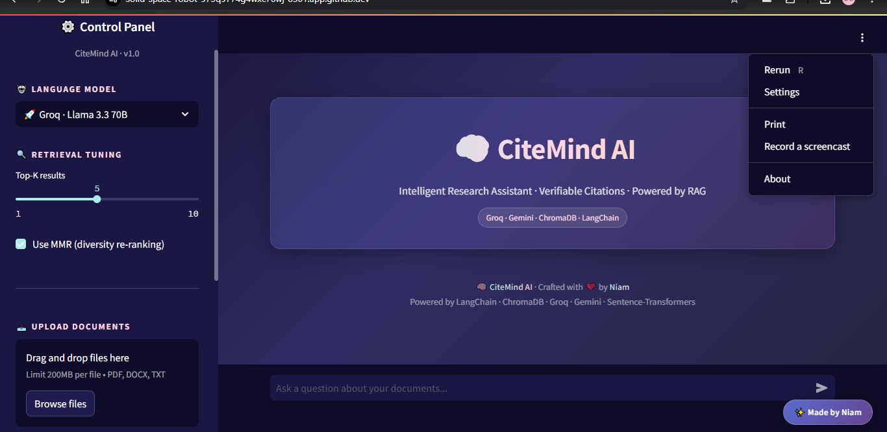
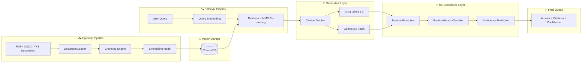
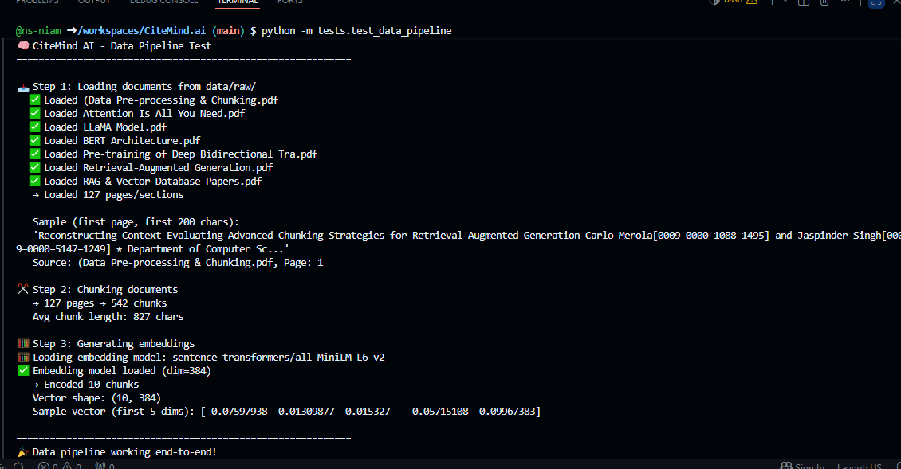
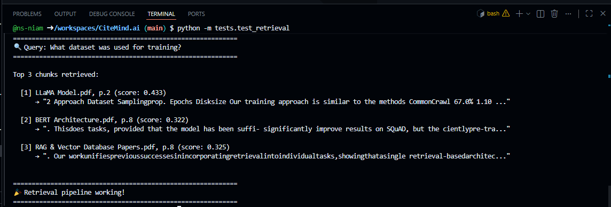
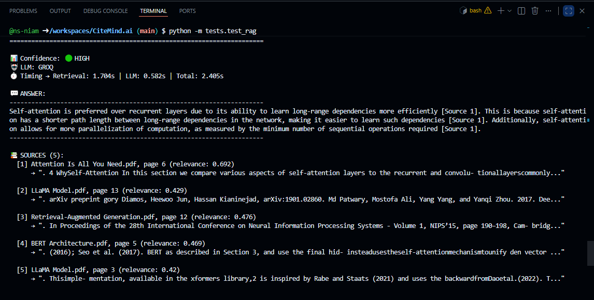
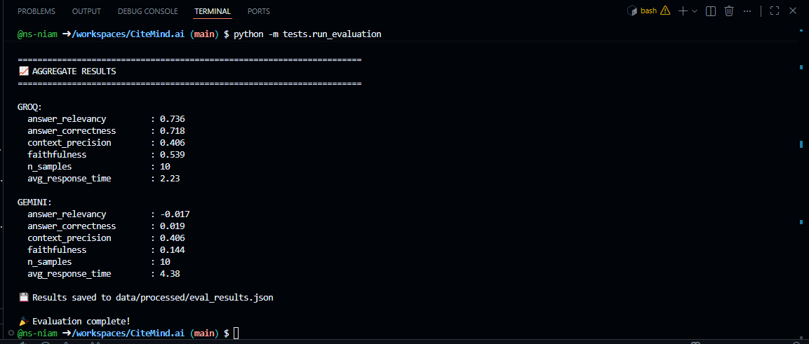
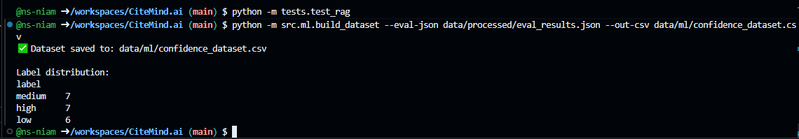
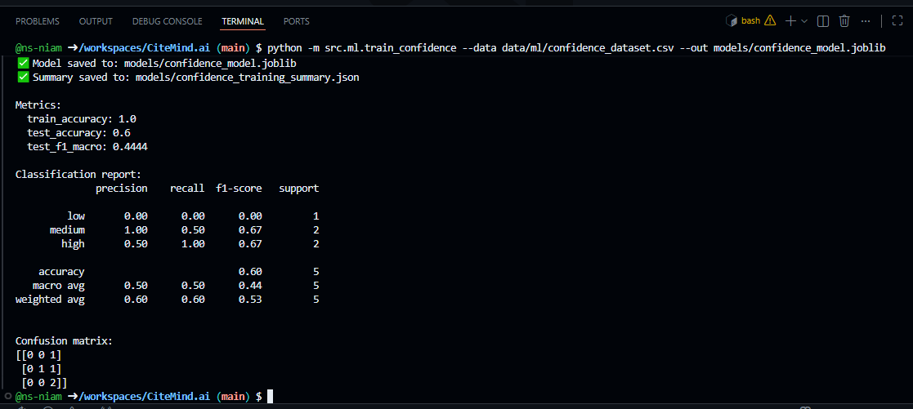
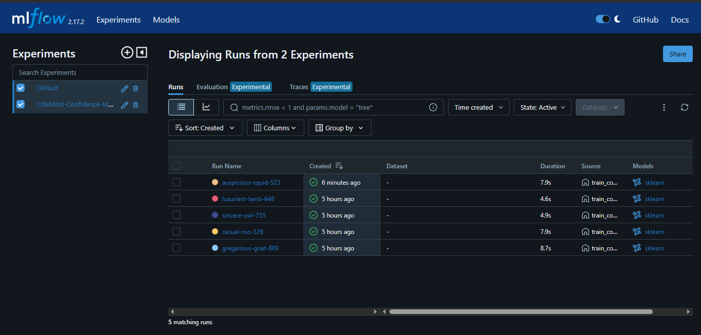
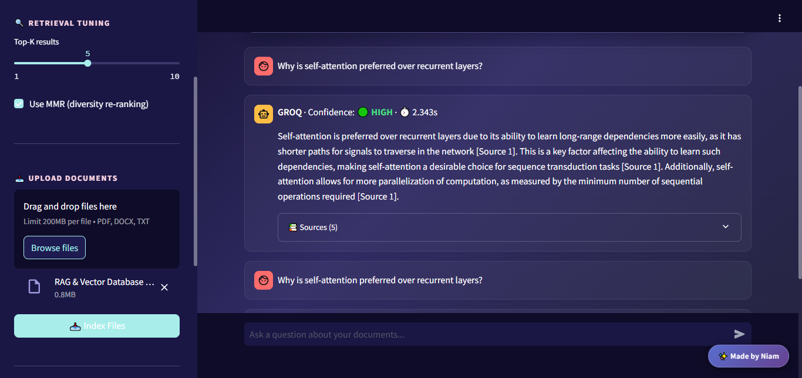

<div align="center">

# 🧠 CiteMind AI

### *Hybrid ML + RAG Research Assistant with Verifiable Citations*

**Stop trusting hallucinating AI. Start verifying every answer.**

<p align="center">
  
  
  
  
  
  
  
  
</p>

<p align="center">
  
  
  
  
</p>

---

### 🚀 AI-Powered Research. Grounded in Real Sources.

CiteMind AI combines Retrieval-Augmented Generation (RAG), semantic search, dual-LLM reasoning, citation-aware prompting, and ML-based confidence prediction to create a trustworthy AI research assistant.

🔗 Upload research papers → Ask questions → Retrieve grounded answers → Verify citations → Predict confidence.

---

### ▶ Watch Demo

[](https://github.com/user-attachments/assets/7c221cc4-25ee-45ce-aa6f-fd61f4dba447)

---

📖 [Documentation](#-system-architecture) •
⚡ [Quick Start](#-quick-start) •
📊 [Evaluation](#-evaluation-results) •
🧠 [ML Confidence System](#-ml-based-confidence-prediction)

</div>

---
---

# 🌟 Why CiteMind AI?

| 🛡️ Anti-Hallucination | ⚡ Dual LLM Architecture | 📚 Verifiable Citations |
|---|---|---|
| Refuses to answer when retrieval confidence is low. No fake citations. | Switch between Groq (speed) and Gemini (deep reasoning). | Every claim links back to document + page + chunk. |

---

# 🎯 The Problem

Every year, researchers face an overwhelming flood of academic information.

- 📄 **Millions of new papers** published annually  
- ⏳ Researchers spend countless hours on literature review  
- 🤖 Traditional LLMs hallucinate facts and invent citations  
- 🔍 Search engines return documents, not trustworthy answers  

## The Result

AI becomes fast — but unreliable for serious research.

---

# 💡 The Solution

CiteMind AI solves this using an advanced **Retrieval-Augmented Generation (RAG)** pipeline.

```text
📄 Documents
      ↓
🧠 Semantic Retrieval
      ↓
📌 Citation Tracking
      ↓
🤖 Grounded LLM Generation
      ↓
✅ Verifiable Research Answers
```
### Core Innovations

* 🔍 Semantic document search
* 📚 Chunk-level citation grounding
* ⚡ Dual-LLM reasoning system
* 🚦 Confidence-aware refusal mechanism
* 🛡️ Hallucination-resistant responses

---

# 🏗️ System Architecture

<p align="center">
  
</p>




# ✨ Features

## 📄 Multi-Format Document Support

* PDF ingestion with page metadata
* DOCX document parsing
* TXT file support
* Drag & drop uploads
* Persistent vector storage

---

## 🔍 Advanced Retrieval System

* Dense semantic search
* MMR re-ranking
* Top-K retrieval optimization
* Fast embedding-based similarity search
* Context-aware chunk selection

---

## 🤖 Dual LLM Architecture

| Model | Purpose |
|---|---|
| ⚡ Groq Llama 3.3 70B | Ultra-fast responses |
| 🧠 Gemini 2.5 Flash | Deeper reasoning & analysis |

### Benefits

* Live model switching
* Speed vs reasoning flexibility
* Better experimentation for research workflows

---

## 🛡️ Hallucination Protection

CiteMind AI uses a **3-tier confidence system**:

| Confidence | Behavior |
|---|---|
| 🟢 High | Confident cited answer |
| 🟡 Medium | Answer with warning |
| 🔴 Low | Refuses to hallucinate |

### No fake citations. No fabricated facts.

---

# ✅ 9️⃣ SCREENSHOTS SECTION  ⭐

---

## 📄 Data Pipeline



---

## 🔍 Retrieval Pipeline



---

## 🧠 Full RAG Pipeline



---

## 📊 Evaluation Metrics



---

## 🧪 Dataset Generation



---

## 🤖 ML Confidence Training



---

## 📈 MLflow Dashboard



---

## 🌐 Streamlit Web Application


---

## 💬 Citation-Aware Results

---

# 🛠️ Tech Stack

| Layer                  | Technology              |
| ---------------------- | ----------------------- |
| 🐍 Language            | Python 3.12             |
| 🔗 Framework           | LangChain               |
| 🧮 Embeddings          | all-MiniLM-L6-v2        |
| 💾 Vector Database     | ChromaDB                |
| ⚡ Fast LLM             | Groq Llama 3.3 70B      |
| 🧠 Reasoning LLM       | Gemini 2.5 Flash        |
| 🧠 ML Model            | RandomForestClassifier  |
| 📊 Experiment Tracking | MLflow                  |
| 🎨 Frontend            | Streamlit               |
| 📊 Visualization       | Matplotlib, Plotly      |
| 📄 Document Parsing    | pdfplumber, python-docx |
| 🐳 Deployment          | Docker                  |

---

# ⚡ Quick Start

## 📦 Installation

```bash id="zjz7k0"
# Clone repository
git clone https://github.com/ns-niam/CiteMind.ai.git

# Enter project directory
cd CiteMind.ai

# Install dependencies
pip install -r requirements.txt
```

---

## 🔑 Environment Variables

Create a `.env` file:

```env id="3c06tk"
GROQ_API_KEY=your_groq_api_key
GOOGLE_API_KEY=your_google_api_key
DEFAULT_LLM=groq
```

---

# 🚀 Run the Project

## 🌐 Streamlit Web Application

### ▶ Local Run

```bash id="eq7s7z"
streamlit run app.py
```

Open in browser:

```text id="21y0d3"
http://localhost:8501
```

---

### ☁️ GitHub Codespaces Run

```bash id="5dg5x6"
streamlit run app.py --server.port 8501 --server.address 0.0.0.0
```

Then open the forwarded port:

```text id="k6gnxv"
PORTS → 8501 → Open in Browser
```

---

## 💻 CLI Research Chat

```bash id="e6wwd9"
python chat.py
```

---

## 📓 Jupyter Notebook Demo

```bash id="7chpjw"
jupyter notebook notebooks/CiteMind_Demo.ipynb
```

---

## 📊 Launch MLflow Dashboard

### ▶ Local Run

```bash id="qwe6h8"
mlflow ui
```

Open:

```text id="u6eb4u"
http://localhost:5000
```

---

### ☁️ GitHub Codespaces Run

```bash id="7z9jbg"
mlflow ui --host 0.0.0.0 --port 5000
```

Then open:

```text id="lbo1t2"
PORTS → 5000 → Open in Browser
```

---


# 📁 Project Structure

```bash
CiteMind.ai/
│
├── 📂 src/                              # Core source code
│   │
│   ├── 📂 data/
│   │   ├── loader.py                    # PDF/DOCX/TXT loaders
│   │   ├── chunker.py                   # Recursive text splitting
│   │   └── ingest.py                    # End-to-end ingestion
│   │
│   ├── 📂 embeddings/
│   │   └── embedder.py                  # Sentence-Transformers wrapper
│   │
│   ├── 📂 retrieval/
│   │   ├── vectorstore.py               # ChromaDB integration
│   │   └── retriever.py                 # Top-K + MMR retrieval
│   │
│   ├── 📂 generation/
│   │   ├── llm.py                       # Groq + Gemini wrapper
│   │   ├── prompts.py                   # Citation-aware prompts
│   │   ├── citations.py                 # Citation tracker
│   │   └── rag_engine.py                # Hybrid ML + RAG engine
│   │
│   ├── 📂 evaluation/
│   │   ├── evaluator.py                 # RAG evaluation pipeline
│   │   └── visualize.py                 # Metrics visualization
│   │
│   ├── 📂 ml/
│   │   ├── build_dataset.py             # Confidence dataset builder
│   │   ├── train_confidence.py          # RandomForest training
│   │   ├── confidence_model.py          # Saved model loader
│   │   ├── confidence_runtime.py        # Runtime inference system
│   │   └── feature_builder.py           # Feature engineering
│   │
│   └── 📂 utils/
│       ├── config.py                    # Environment configuration
│       └── display.py                   # CLI pretty printer
│
├── 📂 notebooks/
│   └── CiteMind_Demo.ipynb              # Full reproducible notebook demo
│
├── 📂 assets/
│   ├── 📂 charts/                       # Evaluation visualizations
│   │   ├── 01_metrics_comparison.png
│   │   ├── 02_response_times.png
│   │   ├── 03_per_query_faithfulness.png
│   │   ├── 04_confidence_distribution.png
│   │   └── 05_radar_chart.png
│   │
│   └── 📂 screenshots/                  # UI & system screenshots
│
├── 📂 SCREENSHOTS/                      # README presentation screenshots
│
├── 📂 demo/
│   └── citemindai.mp4                   # Project demo video
│
├── 📂 tests/
│   ├── eval_queries.py                  # Evaluation question set
│   ├── run_evaluation.py                # Full evaluation runner
│   ├── test_llms.py
│   ├── test_data_pipeline.py
│   ├── test_retrieval.py
│   └── test_rag.py
│
├── 📂 data/
│   ├── 📂 raw/                          # Uploaded documents
│   ├── 📂 ml/                           # ML datasets
│   └── 📂 processed/
│       └── eval_results.json            # Evaluation outputs
│
├── 📂 models/
│   ├── confidence_model.joblib
│   └── confidence_training_summary.json
│
├── 📂 mlruns/                           # MLflow experiment tracking
│
├── 📂 scripts/
│   └── generate_arch_diagram.py
│
├── 🌐 app.py                            # Streamlit web application
├── 💻 chat.py                           # CLI research chat
├── 📋 requirements.txt
├── 🐳 Dockerfile
├── 🐳 docker-compose.yml
├── 🔒 .env.example
├── 🚫 .gitignore
└── 📖 README.md
```

# 📊 Evaluation Results

CiteMind AI was evaluated on academic research queries using RAGAS-inspired metrics.

<div align="center">


</div>

---

````md id="7p90qy"
# 📈 Performance Summary

| Metric | Observation |
|---|---|
| Answer Relevancy | ✅ Strong semantic grounding |
| Context Precision | ⚠️ Moderate retrieval precision |
| Faithfulness | ⚠️ Needs further optimization |
| Response Speed | ⚡ Fast inference with Groq |
| Citation Accuracy | ✅ Citation-aware responses |

---

# 🧪 Methodology

## 📌 Retrieval Pipeline

```text
User Query
    ↓
Embedding Generation
    ↓
Vector Similarity Search
    ↓
MMR Re-ranking
    ↓
Top-K Context Retrieval
    ↓
Grounded LLM Generation
    ↓
ML Confidence Prediction
````

---

## 📚 Chunking Strategy

```python
chunk_size = 1000
chunk_overlap = 200
```

Optimized for:

* Academic papers
* Long-form technical documents
* Better semantic continuity

---

# 🗺️ Roadmap

* [x] Core RAG Pipeline
* [x] Dual LLM Integration
* [x] Citation Tracking
* [x] Evaluation Framework
* [x] ML-Based Confidence Prediction
* [x] MLflow Experiment Tracking
* [x] Docker Support
* [ ] Hybrid Search (BM25 + Dense)
* [ ] Cross-Encoder Re-Ranking
* [ ] Conversational Memory
* [ ] Multi-Modal Retrieval
* [ ] Cloud Deployment
* [ ] Mobile Application

---

# 🆚 Comparison with Existing Tools

| Feature                  | ChatGPT | Perplexity | NotebookLM | CiteMind AI |
| ------------------------ | ------- | ---------- | ---------- | ----------- |
| Open Source              | ❌       | ❌          | ❌          | ✅           |
| Self Hostable            | ❌       | ❌          | ❌          | ✅           |
| Citation Tracking        | ❌       | ✅          | ✅          | ✅           |
| Multi-LLM Support        | ❌       | ❌          | ❌          | ✅           |
| User Document Support    | ❌       | ❌          | ✅          | ✅           |
| ML Confidence Prediction | ❌       | ❌          | ❌          | ✅           |
| Built-in Evaluation      | ❌       | ❌          | ❌          | ✅           |
| Hallucination Refusal    | ❌       | ❌          | ❌          | ✅           |

---

# 📚 Documentation

| Document                | Description                 |
| ----------------------- | --------------------------- |
| 📄 Final Report         | Complete academic report    |
| 🎤 Presentation         | Defense presentation slides |
| 📓 Demo Notebook        | Reproducible notebook       |
| 📋 Problem Statement    | Research motivation         |
| 📚 Literature Review    | Related work                |
| 🏗️ System Architecture | Technical design            |
| 🧠 ML Design Decisions  | Engineering choices         |

---

---

# ⚠️ Current Limitations

Although CiteMind AI demonstrates a strong hybrid ML + RAG architecture, several limitations still remain.

| Limitation | Description |
|---|---|
| 📉 Limited Evaluation Dataset | Current evaluation uses a relatively small handcrafted query set. |
| ⚠️ Moderate Faithfulness | Some generated responses may still partially hallucinate under weak retrieval conditions. |
| 📚 Retrieval Precision | Dense retrieval alone may miss highly specific keyword-based matches. |
| 🧠 No Conversational Memory | The system currently handles single-turn queries only. |
| 🌐 No Cloud Deployment Yet | Deployment is currently local / Codespaces based. |
| 🎥 No Multi-Modal Support | Images, tables, and figures inside PDFs are not deeply analyzed yet. |
| 💾 Embedding Constraints | Lightweight embedding models may reduce semantic depth for highly technical domains. |

---

## 🚀 Planned Improvements

Future versions aim to include:

* Hybrid Retrieval (BM25 + Dense Search)
* Cross-Encoder Re-ranking
* Better hallucination mitigation
* Multi-modal document understanding
* Cloud deployment support
* Larger benchmark evaluation datasets
* Conversational memory and session persistence

---


# 🤝 Contributing

Contributions, ideas, and improvements are welcome.

```bash
# Create feature branch
git checkout -b feature/amazing-feature

# Commit changes
git commit -m "Add amazing feature"

# Push branch
git push origin feature/amazing-feature
```

---

# 📜 License

Copyright © 2026 Niam. All rights reserved.

This repository is shared publicly for educational and research purposes only.

Commercial use, redistribution, sublicensing, or deployment of modified versions is prohibited without explicit written permission from the author.

If you are interested in collaboration, research, or licensing opportunities, please contact the author.

---

# 🙏 Acknowledgments

Special thanks to:

* Lewis et al. for the RAG paradigm
* Sentence-BERT researchers
* RAGAS framework authors
* Groq & Google AI Studio
* Open-source AI community

---

# 👨‍💻 Author

<div align="center">

# Md Sha Niamatullah (Niam)

### *Building trustworthy AI systems for the future of research.*

📧 Open to AI/ML internships, collaborations, and research opportunities.

### ⭐ If you found this project useful, give it a star!

> *“Trustworthy AI is not just about generating answers — it is about proving them.”*

</div>

---

<div align="center">

## 🧠 CiteMind AI

### Made with ❤️ by Niam

</div>
```

