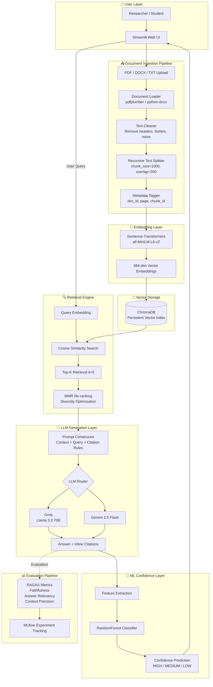
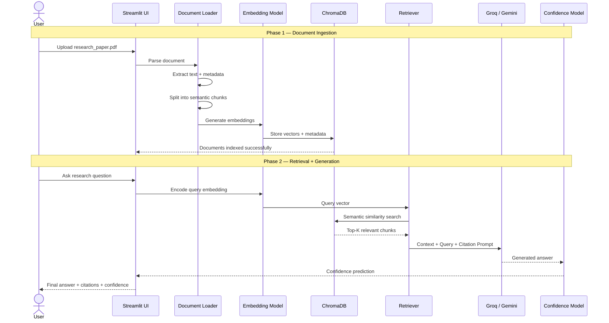
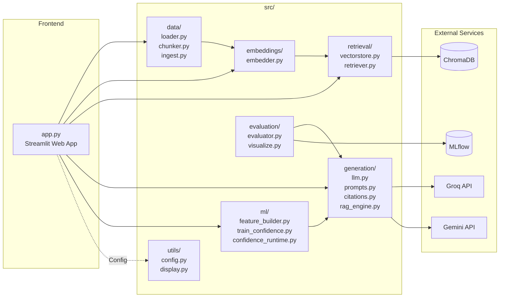

# CiteMind AI — System Architecture

## 1. End-to-End System Architecture

---

## 2. Data Flow Diagram

---

## 3. Component-Level Architecture

---

## 4. Production Deployment Roadmap

### 🚀 Phase 1 — MVP (Current System)

| Component | Technology |
| --- | --- |
| Frontend | Streamlit Cloud |
| Vector DB | Local ChromaDB |
| LLM APIs | Groq + Gemini |
| Storage | Local persistent index |
| Scale | Single-user / small dataset |

---

### ⚡ Phase 2 — Scale-Up Architecture

| Component | Technology |
| --- | --- |
| Deployment | Docker + AWS ECS / Cloud Run |
| Vector DB | Pinecone / Hosted ChromaDB |
| Caching | Redis |
| API Layer | FastAPI |
| Scaling | Multi-user support |

---

### 🏢 Phase 3 — Enterprise Architecture

| Component | Technology |
| --- | --- |
| Orchestration | Kubernetes |
| Authentication | OAuth2 + RBAC |
| Task Queue | Celery + RabbitMQ |
| Monitoring | Prometheus + Grafana |
| Vector DB | Distributed Qdrant Cluster |
| Multi-Tenancy | Per-user namespaces |

---

## 5. Architectural Highlights

- Hybrid ML + RAG architecture
- Semantic retrieval with vector embeddings
- Citation-aware grounded generation
- Dual LLM routing (Groq + Gemini)
- ML-based confidence prediction
- Experiment tracking using MLflow
- Docker-ready deployment strategy
- Scalable future enterprise roadmap
